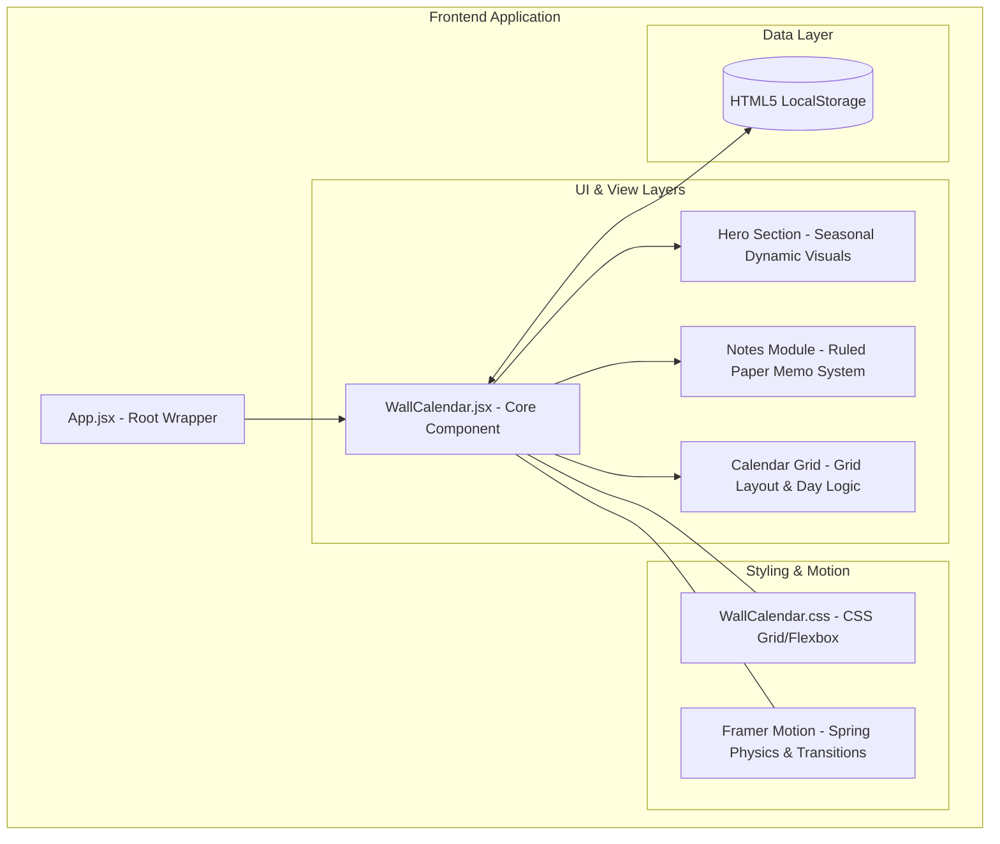

# 🗓️ Premium Wall Calendar — Full-Stack Internship Challenge

> A professional-grade, high-fidelity interactive React component designed to bridge the gap between physical aesthetics and digital functionality.

---

## 🌟 Executive Overview

This project delivers a sophisticated **Wall Calendar** component that prioritizes user experience (UX) and visual storytelling. Rather than a standard date picker, this is a **lifestyle-driven productivity tool** featuring seasonal imagery, editorial typography, and the unique physical presence of a "Wall Calendar" (including ring binding and wavy transitions).

### 🚀 [Live Demo Link (if deployed)] | 🎥 [Walkthrough Video]

---

## 🏗️ Technical Architecture

The application is built on a **Modular React Architecture** with a focus on single-responsibility components and centralized state management via React Hooks.



---

## 🛠️ Tech Stack & Engineering Choices

- **React 18 & Vite**: Used for near-instant HMR and a modern development workflow.
- **Framer Motion**: Leveraged the `AnimatePresence` and `layout` props to create "magazine-style" smooth transitions between months.
- **Vanilla CSS (Custom)**: Avoided heavy UI frameworks to maintain total control over the **Wavy Separator** and **Ring Binding** aesthetics.
- **LocalStorage API**: Implemented a "Persistence Middleware" feel to ensure user notes survive refreshes and sessions without a dedicated backend.

---

## 💎 Premium Features

| Feature | Description | Engineering Detail |
| :--- | :--- | :--- |
| **Physical Aesthetic** | Ring binding & Wavy SVG transition | Custom CSS gradients and SVG path masking |
| **Dual Selection** | Start/End date range selection | State-driven day mapping with `dk` keys |
| **Ruled Notes** | Auto-saving digital memo pad | `repeating-linear-gradient` for authentic look |
| **Smart Themes** | 4 Curated Palette Switches | Global CSS variables mapped to React state |
| **Responsive Grid** | Adaptive Side-by-Side Layout | CSS Grid with mobile-first media queries |

---

## � Project Structure

```text
Calender/
├── src/
│   ├── WallCalendar.jsx    # Core logic, date math, & component tree
│   ├── WallCalendar.css    # Premium design system & typography
│   ├── App.jsx             # Main application entry
│   ├── index.css           # Global resets & font imports
│   └── main.jsx            # React root mount
├── public/                 # Static assets
└── README.md               # Executive documentation
```

---

## 🚀 Installation & Deployment

### Local Setup
1. **Clone & Install**:
   ```bash
   npm install
   ```
2. **Launch Dev Server**:
   ```bash
   npm run dev
   ```

### Production Deployment
This is a **Frontend-only** build, making it highly portable.
- **Vercel/Netlify**: Auto-deploy by connecting your Git branch.
- **Build manually**: `npm run build` generates a `dist/` folder ready for any static host.

---

## 🔮 Future Roadmap

- [ ] **Multi-user Sync**: Integrate Firebase/Supabase for cross-device note sharing.
- [ ] **Google Calendar Sync**: View real-world events directly in the Wall Calendar.
- [ ] **Custom Hero Uploads**: Allow users to drag-and-drop their own photos for months.
- [ ] **Dark Mode Support**: A high-contrast version for late-night planning.

---

## 👨‍💻 Submission Notes
Developed as part of the **Software Engineering Internship Challenge**. The focus was not just on fulfilling requirements, but on exceeding them through **creative engineering** and **detail-oriented design**.

**Thank you for reviewing!**
